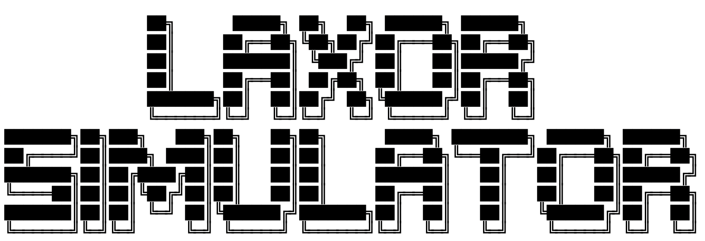
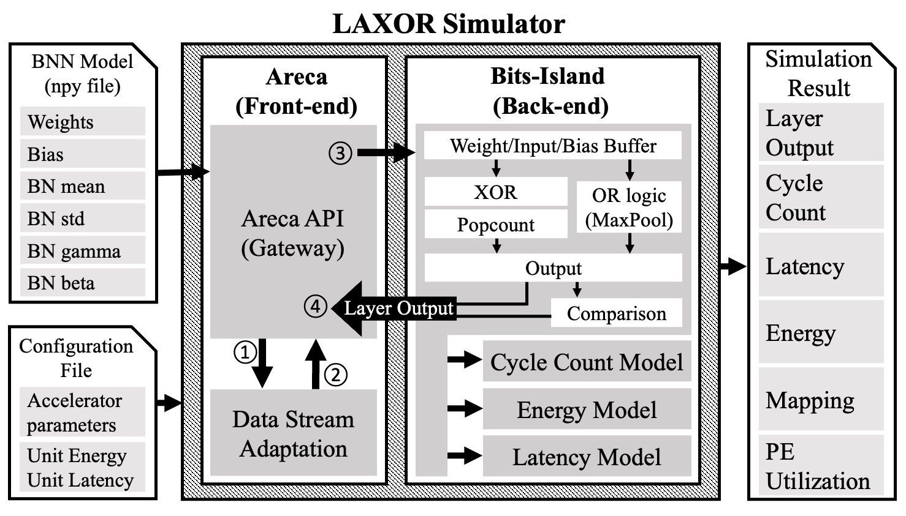

# Toochain of LAXOR Simulator
The square on the middle is the BNN accelerator simulator named LAXOR Simulator. It has two part: one is front-end named Areca connecting between software and hardware and adapting data stream for hardware computation. Other is back-end imitating LAXOR architecture such as XOR and Popcount operation. It also calculates cycle count and estimate energy consumption and latency. The input for LAXOR Simulator is pre-trained BNN model which contains weights, bias, and four parameters of batch normalization. The configuration file has some parameter in terms of hardware architecture such as the number of PEs, the number of Latch-XOR per one PE, buffer size, and so on.



# Requirement

* Python 3.x (recommend 3.8)
* Pytorch
* Torchvision
* Numpy
* Matplotlib

# How to use LAXOR Simulator
### ■ Initilazation
```python
from LAXOR_Sim.Areca import Areca
areca = Areca()
```

### ■ Load weights, bias, and parameters of batch normalization
```python
import LAXOR_Sim.Tool as tool

# data path
weights_path = './XXX/weights.npy'
bias_path = './XXX/bias.npy'
beta_path = './XXX/BNbeta.npy'
gamma_path = './XXX/gamma.npy'
mean_path = './XXX/mean.npy'
std_path = './XXX/std.npy'

# load data
weights, bias, beta, gamma, mean, std = tool.load_npys(weights_path,
                                                       bias_path,
                                                       beta_path,
                                                       gamma_path,
                                                       mean_path,
                                                       std_path)
                                                       
                                                       

```

### ■ Binarized Convolution Layer (Computed by out of LAXOR accelerator)
If you want to compute binarized convolution layer by out of LAXOR accelerator, pls use this function. For example, it is useful if input is not binary and weights is binary.
```python
# input
input = img

# re-flip if you trained BNN model by theano & lasagne package
weights = tool.filpWeight_lasagne(weights)

# inverse std of BN if you trained BNN model by theano & lasagne package
std = tool.inverseStd_lasagne(std)


# output Simulator
# if you want to run batch normalization after convolution layer, select BatchNorm='ON'.
# if not, select BatchNorm='OFF'
out = areca.CPU_Binary_Conv2D(
                              input=input,
                              weights=weights,
                              bias=bias,
                              stride=1,
                              padding=0,
                              BatchNorm='ON',
                              BN_gamma=gamma,
                              BN_beta=beta,
                              BN_mean=mean,
                              BN_std=std)
```

### ■ Binarized Convolution Layer (Computed by LAXOR accelerator)
output: 4D numpy array [0 or 1]
```python
# output Simulator
out = areca.Binary_Conv2D(input=input,
                          weights=weights,
                          bias=bias,
                          stride=1,
                          padding=0,
                          BatchNorm='ON',
                          BN_gamma=gamma,
                          BN_beta=beta,
                          BN_mean=mean,
                          BN_std=std)
```

### ■ Binarized Fully Connected Layer
output: 2D numpy array [0 or 1]
```python
out = areca.Binary_FullyConnected(input=input, weights=weights, bias=bias)
```

### ■ Max Pooling Layer
output: 4D numpy array [0 or 1]
```python
kernel_size = 2
stride = 2
out = areca.MaxPooling(input=input, ksize=kernel_size, stride=stride)
```

# Simulation Result
LAXOR Simulator creates a log file and some figures & numbers, and stores them on the "Sim Result" folder.
* log file (txt)
* cycle count figure (eps)
* energy consumption (eps)
* cycle count matrix (csv)
* latency matrix (csv)
* energy consumption (csv)

# Example
We provide an example to run LAXOR Simulator with random values.
```python
python Example1_cifar10.py
```

# Configuration
```python
# Log file
LOG_FILE = 'Test.txt' # the name of a log file

# PEs
PENUMS = 256 # the number of PEs
BIT_SIZE_PE = 1024 # the number of Latch-XOR per one PE

# OR logic
ORNUMS = 256
ORBITWIDTH = 4

# BUFFER
a = 1024
BUFFERSIZE_INPUT = a #bits
BUFFERSIZE_WEIGHTS = a #bits
BUFFERSIZE_BIAS = 9 # bits

# I/O
PINS_IW = 8 # the number of pins for input or weights buffer

# BATCH NORMALIZATION
# if you trained your model by theano and lasagne, please EPSILON = 0
EPSILON = 0

# CIFAR10
NUM_LABELS = 10 # the number of labels
```

# Latest Update info.
* version1.1 21st Sep. 2022 
* version1.0 24th Aug. 2022 
